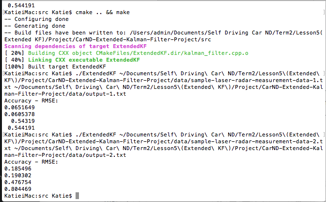

# Extended Kalman Filter Project 
Implement a C++ based Extended Kalman Filter for Lidar/Radar data. The Extended Kalman filter is used for predicting the position of the pedestrian using Lidar & Radar data. 

## Project Code
The project can be cloned or downloaded [here](https://github.com/spgitmonish/ExtendedKalmanFilter)
## Dependencies

* **cmake** >= 3.5
 * All OSes: [click here for installation instructions](https://cmake.org/install/)
* **make** >= 4.1
  * Linux: make is installed by default on most Linux distros
  * Mac: [install Xcode command line tools to get make](https://developer.apple.com/xcode/features/)
  * Windows: [Click here for installation instructions](http://gnuwin32.sourceforge.net/packages/make.htm)
* **gcc/g++** >= 5.4
  * Linux: gcc / g++ is installed by default on most Linux distros
  * Mac: same deal as make - [install Xcode command line tools]((https://developer.apple.com/xcode/features/)
  * Windows: recommend using [MinGW](http://www.mingw.org/)

## Basic Build Instructions

1. Clone this repo.
2. Make a build directory(delete any existing directories): `mkdir build && cd build`
3. Compile: `cmake .. && make` 
   * On windows, you may need to run: `cmake .. -G "Unix Makefiles" && make`
4. Run it: `./ExtendedKF path/to/input.txt path/to/output.txt`. You can find
   some sample inputs in 'data/'.
    - eg. `./ExtendedKF ../data/sample-laser-radar-measurement-data-1.txt output.txt`

*NOTE*: Regardless of the changes you make, your project must be buildable using
cmake and make!

## Project Folder Structure
* **CarND-Extended-Kalman-Filter-Project** - This is the main code folder where majority of the work is done. The breakdown is as follows:

	* *CmakeLists.txt*: Contains the configuration to run the project files using cmake and make.
	* */data*: Contains the data input files used for testing the model.
	* */Docs*: Documentation for generating additional data and also information about the input `.txt` files.
	* */ide_profiles*: For any IDE profiles created(optional).
	* */src*: Contains all the source code
		* `main.cpp` - Reads in data, calls a function to run the Kalman filter, calls a function to calculate RMSE.
		* `FusionEKF.cpp` - Initializes the filter, calls the predict function, calls the update function.
		* `kalman_filter.cpp` - Defines the predict function, the update function for lidar, and the update function for radar.
		* `tools.cpp` - Function to calculate RMSE and the Jacobian matrix.

* **CarND-Extended-Kalman-Filter-Project** - Utilities for generating additional data using matlab/python

## 2-D Visualizer
Udacity has provided a way to visualize the effectiveness of a EKF model. The simulator can be downloaded here

[Windows](https://d17h27t6h515a5.cloudfront.net/topher/2017/March/58d07003_kalman-tracker-windows/kalman-tracker-windows.zip)

[Mac](https://d17h27t6h515a5.cloudfront.net/topher/2017/March/58d07064_kalman-tracker-mac.app/kalman-tracker-mac.app.zip)

[Linux](https://d17h27t6h515a5.cloudfront.net/topher/2017/March/58d96544_kalman-tracker-linux/kalman-tracker-linux.zip)

The Kalman Filter Tracker program is a visualization tool that plots noisy lidar and radar measurements as a simulated car drives in a figure eight pattern. The program can also record measurement data directly to a text file and then use a python script to call a compiled C++ Kalman Filter file to track estimated markers and RMSE values visually in real time.

### Usage instructions
Copy and Save [kalman-tracker.py](https://d17h27t6h515a5.cloudfront.net/topher/2017/March/58d07228_kalman-tracker/kalman-tracker.py) script code. This is used to communicate between the simulator and your compiled c++ kalman filter program. The script requires 1 argument which is the path to your compiled C++ file. Here is an example for how to call the script.

`python kalman_tracker.py ./main.out`

*NOTE*: There might be additional libraries required for running socket communication. This starter kit by udacity has all the libraries(and more) required to run the above code. The starter kit can be found here: [Environment Setup](https://github.com/udacity/CarND-Term1-Starter-Kit)

### Running the program
1. First open the simulator program (Preferred: Resolution of *1600 x 900* , Graphics Quality set to *Simple*)
2. Click **Record Data** in the simulator, a browser will then open to where you want to save your text file output. Make sure the path is the same as where `kalman_tracker.py` file is.
3. Run `kalman_tracker.py` with path to your compiled c++ file.
4. Click **Run** in the simulator to see estimation markers and RMSE values displayed in real time as measurement markers are collected.
5. Experiment with turning on/off lidar and radar measurements on the lower left of the simulator to see how RMSE is effected.

*Note about RMSE*: To display RMSE values on the simulator, turn on the flag `DEBUG_SIMULATOR_OUTPUT` in `main.cpp`. The output format expected by the simulator. 

## Expected output
1. Screenshot of the terminal with the build, compile and test sequence. The RMSE output for different data sources can be seen in this screen shot.

   

   <i>Figure 1</i>

2. Validation using the 2-D visualizer. The green triangles are the predictions made by the model. RMSE output can also be seen in the simulator.

   

   <i>Figure 2</i>

## Final thoughts
This model is based on Udacity's code. I modified it by removing certain layers, restructuring & optimizing certain operations. 

